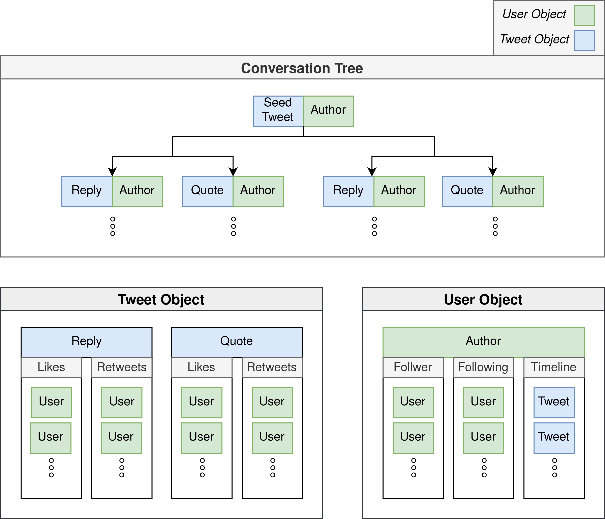

# Cancel-Culture-Crawler
# Social Media Data Collection of Cancel Culture Events

Twitter Crawler to automatically fetch and store tweets surrounding the topic and network of Cancel Culture on Twitter.
This crawler uses the official Twitter API v2 to request data from Twitter, processes it and stores it in a MongoDB database.
Specifically, it is able to use a seed tweet and crawl it's whole conversation tree including all replies,
quotes and participating users. Moreover, a complete list of tweets a participating user has published in the past can be crawled,
as well as all users he follows or which follow him. Furthermore, up to 100 likes and 100 retweets of each of the individual tweets
from the original conversation tree tweets can be crawled (currently maximum due to Twitter API limitations).
Lastly, this pipeline can be also used to crawl hashtags and user mentions, and their respective conversation trees and participating users. 
It is designed in a way to easily expand its functionality on virtually any data the Twitter API allows crawling for.
## Getting started
To use the crawler some packages and configuration steps are needed.
### Package installation
Clone the repository and run the following commands:
````
$ cd cancel-culture-crawler
$ pip install -r requirements.txt
````

### Configuration
The crawler uses the [config.ini](config.ini) file to allow for some initial configurations. 
For the crawler to work and talk to twitter.com a bearer token (authentication token) is needed. Either set the bearer
token inside the config file explicitly or better define it as the following environment variable `` TWITTER_BEARER_TOKEN `` 
on your system. Note: Beware of committing authentication tokens to (public) repositories.

Furthermore, a MongoDB server is needed to store the data. Installation instructions can be found [here](https://docs.mongodb.com/manual/installation/).
Inside the [config.ini](config.ini) you can specify the IP, port and database name.

### Methods
The following list of methods can be used for crawling. See [main.py](https://gitlab.inf.uni-konstanz.de/tobias.nusser/cancel-culture-crawler/-/blob/main/crawler/main.py) as an entry point to the crawler.
#### 1. Collecting conversation trees
``bot.get_seed(tweet_id)`` allows to crawl a single tweet (seed tweet of conversation) with a tweet id as argument

``bot.pipeline(tweet_id)`` allows to crawl all replies and quotes to the tweet with the specified tweet id, as well as all user profiles of the users that wrote those replies/quotes

`` bot.hashtag_or_mention(hashtags_or_mentions, start, end)`` allows to crawl all tweets that contain the specified hashtags or mention. Example:
``hashtags_or_mentions = {"#exampleHashTag", "@exampleUser"}``. The attributes ``start`` and ``end`` are dates in the format YYYY-MM-DDTHH:mm:ssZ (ISO 8601/RFC 3339)
#### 2. Collecting likes, retweets, followers, timelines
``bot.crawl_likes()`` retrieves the (100 most recent) liking users for all tweets that were crawled in the first step according to the ``likes_crawled`` attribute in the database collection [cc_tweets](#collection-cc_tweets). 
Results are stored in the database collection [cc_users](#collection-cc_users) at the attribute ``liked``.

``bot.crawl_retweets()`` retrieves the (100 most recent) retweeting users for all tweets that were crawled in the first step according to the ``retweets_crawled`` attribute in the database collection [cc_tweets](#collection-cc_tweets). 
Results are stored in the database collection [cc_users](#collection-cc_users) at the attribute ``retweeted``.

``bot.crawl_timelines()`` retrieves all timeline tweets of users that were crawled in the first step according to the ``timeline_crawled`` attribute in the database collection [cc_users](#collection-cc_users). 
Results are stored in the database collection [cc_timelines](#collection-cc_timelines).

``bot.crawl_following()`` retrieves users that are followed by the users crawled in the first step according to the ``following_crawled`` attribute in the database collection [cc_users](#collection-cc_users). 
Results are stored in the database collection [cc_follows](#collection-cc_follows) at the attribute ``followed_by``.

``bot.crawl_follows()`` retrieves users that follow the users that were crawled in the first step according to the ``followers_crawled`` attribute in the database collection [cc_users](#collection-cc_users). 
Results are stored in the database collection [cc_follows](#collection-cc_follows) at the attribute ``following``.


## Complete Pipeline


### Examples for documents that are stored in their respective collections
#### cc_tweets and cc_timelines
````json
{
  "_id": {
    "$oid": "619b9f8799a4809d6ee03245"
  },
  "text": "In the past 48hrs, the USA horrifically lost 34 people to mass shootings.\n\nOn average, across any 48hrs, we also lose…\n\n500 to Medical errors\n300 to the Flu\n250 to Suicide\n200 to Car Accidents\n40 to Homicide via Handgun\n\nOften our emotions respond more to spectacle than to data.",
  "possibly_sensitive": false,
  "author_id": "19725644",
  "conversation_id": "1158074774297468928",
  "public_metrics": {
    "retweet_count": 71267,
    "reply_count": 70954,
    "like_count": 273941,
    "quote_count": 44650
  },
  "reply_settings": "everyone",
  "source": "TweetDeck",
  "created_at": "2019-08-04T17:58:36.000Z",
  "lang": "en",
  "id": "1158074774297468928",
  "seed": "1158074774297468928",
  "crawl_timestamp": {
    "$date": "2021-11-22T13:47:50.884Z"
  },
  "likes_crawled": false,
  "retweets_crawled": false
}
````
#### cc_users 
````json
{
  "_id": {
    "$oid": "619ba15899a4809d6ee1be50"
  },
  "created_at": "2009-01-29T18:40:26.000Z",
  "location": "New York City",
  "url": "http://t.co/FRT5oYtwbX",
  "name": "Neil deGrasse Tyson",
  "id": "19725644",
  "verified": true,
  "entities": {
    "url": {
      "urls": [
        {
          "start": 0,
          "end": 22,
          "url": "http://t.co/FRT5oYtwbX",
          "expanded_url": "http://www.haydenplanetarium.org/tyson/",
          "display_url": "haydenplanetarium.org/tyson/"
        }
      ]
    }
  },
  "username": "neiltyson",
  "profile_image_url": "https://pbs.twimg.com/profile_images/74188698/NeilTysonOriginsA-Crop_normal.jpg",
  "protected": false,
  "description": "Astrophysicist",
  "public_metrics": {
    "followers_count": 14550932,
    "following_count": 39,
    "tweet_count": 7594,
    "listed_count": 45367
  },
  "seed": "1158074774297468928",
  "crawl_timestamp": {
    "$date": "2021-11-22T13:47:50.884Z"
  },
  "followers_crawled": false,
  "following_crawled": false,
  "timeline_crawled": false,
  "liked": [],
  "retweeted": []
}
````

#### cc_follows 

````json
{
  "_id": {
    "$oid": "61bc94b7b89585883e4d463e"
  },
  "protected": false,
  "pinned_tweet_id": "1467951890281340931",
  "profile_image_url": "https://pbs.twimg.com/profile_images/1383565672827944964/qxxY3h_v_normal.jpg",
  "verified": false,
  "description": "Fair Minded @foxnews  Contributor, Podcast Host, Civil Rights Attorney, Author, Fmr School Teacher. Leo 2.0 on @KABCRadio 5p M-F https://t.co/OCMYXheLBA",
  "name": "TheLeoTerrell",
  "location": "Los Angeles",
  "created_at": "2020-01-02T18:41:53.000Z",
  "entities": {
    "url": {
      "urls": [
        {
          "start": 0,
          "end": 23,
          "url": "https://t.co/CPvNe7lVwC",
          "expanded_url": "https://www.theleoterrell.com",
          "display_url": "theleoterrell.com"
        }
      ]
    },
    "description": {
      "urls": [
        {
          "start": 129,
          "end": 152,
          "url": "https://t.co/OCMYXheLBA",
          "expanded_url": "http://leoterrellhats.com",
          "display_url": "leoterrellhats.com"
        }
      ],
      "mentions": [
        {
          "start": 12,
          "end": 20,
          "username": "foxnews"
        },
        {
          "start": 111,
          "end": 121,
          "username": "KABCRadio"
        }
      ]
    }
  },
  "id": "1212806053907185664",
  "username": "TheLeoTerrell",
  "public_metrics": {
    "followers_count": 674998,
    "following_count": 166,
    "tweet_count": 10494,
    "listed_count": 830
  },
  "url": "https://t.co/CPvNe7lVwC",
  "seed": "1466829037645582341",
  "crawl_timestamp": {
    "$date": "2021-12-17T13:23:56.000Z"
  },
  "following": [],
  "followed_by": [
    "933167783931768832",
    "69891324",
    "46979679",
    "4834717955",
    "2764278646",
    "768316345385644032",
    "1222608612817866758",
    "1337386031188996099",
    "..."
  ]
}
````

### Events
[Neil de Grasse Tyson](
https://twitter.com/neiltyson/status/1158074774297468928) - Event-ID 1
TODO events 

## TODO VEREINFACHTE VERSION DB SCHEMA

## Database Schema


### Collection cc_tweets 
| Idx | Field Name | Data Type | Description |
|---|---|---|---|
| *🔑 | <a name='twitter_db.cc_tweets__id'>&#95;id</a>| oid  | Unique object id generated by mongoDB |
|  | <a name='twitter_db.cc_tweets_attachments'>attachments</a>| object  | Specifies the type of attachments &#40;if any&#41; present in this Tweet&#46; |
| *| <a name='twitter_db.cc_tweets_attachments.media_keys'>attachments&#46;media&#95;keys</a>| array  | List of unique identifiers of media attached to this Tweet&#46; |
| *| <a name='twitter_db.cc_tweets_author_id'>author&#95;id</a>| string  | Unique identifier of this user&#46; Foreign key corresponding to unique id in cc&#95;users |
| *| <a name='twitter_db.cc_tweets_conversation_id'>conversation&#95;id</a>| string  | The Tweet ID of the original Tweet of the conversation &#40;which includes direct replies&#44; replies of replies&#41;  i&#46;e&#46; root of conversation |
| *| <a name='twitter_db.cc_tweets_crawl_timestamp'>crawl&#95;timestamp</a>| date  | Timestamp of the crawling&#46; Format&#58; yyyy&#45;mm&#45;ddThh&#58;mm&#58;ss&#46;000&#43;00&#58;00 |
| *| <a name='twitter_db.cc_tweets_created_at'>created&#95;at</a>| string  | Creation time of the Tweet&#46; For example&#58; 2020&#45;12&#45;10T20&#58;00&#58;10Z |
| *| <a name='twitter_db.cc_tweets_entities'>entities</a>| object  | Contains details about text that has a special meaning in a Tweet&#46; |
|  | <a name='twitter_db.cc_tweets_entities.urls'>entities&#46;urls</a>| array&#91;object&#93;  | Contains details about text recognized as a URL&#46; |
| *| <a name='twitter_db.cc_tweets_entities.urls.start'>entities&#46;urls&#46;start</a>| int  | The start position &#40;zero&#45;based&#41; of the recognized URL within the Tweet&#46; All start indices are inclusive&#46; |
| *| <a name='twitter_db.cc_tweets_entities.urls.end'>entities&#46;urls&#46;end</a>| int  | The end position &#40;zero&#45;based&#41; of the recognized URL within the Tweet&#46; This end index is exclusive&#46; |
| *| <a name='twitter_db.cc_tweets_entities.urls.url'>entities&#46;urls&#46;url</a>| string  | The URL in the format tweeted by the user&#46; |
| *| <a name='twitter_db.cc_tweets_entities.urls.expanded_url'>entities&#46;urls&#46;expanded&#95;url</a>| string  | The fully resolved URL&#46; |
| *| <a name='twitter_db.cc_tweets_entities.urls.display_url'>entities&#46;urls&#46;display&#95;url</a>| string  | The URL as displayed in the Twitter client&#46; |
|  | <a name='twitter_db.cc_tweets_entities.hashtags'>entities&#46;hashtags</a>| array&#91;object&#93;  | Contains details about text recognized as a Hashtag&#46; |
| *| <a name='twitter_db.cc_tweets_entities.hashtags.start'>entities&#46;hashtags&#46;start</a>| int  | The start position &#40;zero&#45;based&#41; of the recognized Hashtag within the Tweet&#46; All start indices are inclusive&#46; |
| *| <a name='twitter_db.cc_tweets_entities.hashtags.end'>entities&#46;hashtags&#46;end</a>| int  | The end position &#40;zero&#45;based&#41; of the recognized Hashtag within the Tweet&#46; This end index is exclusive&#46; |
| *| <a name='twitter_db.cc_tweets_entities.hashtags.tag'>entities&#46;hashtags&#46;tag</a>| string  | The text of the Hashtag&#46; |
|  | <a name='twitter_db.cc_tweets_entities.mentions'>entities&#46;mentions</a>| array&#91;object&#93;  | Contains details about text recognized as a user mention&#46; |
| *| <a name='twitter_db.cc_tweets_entities.mentions.start'>entities&#46;mentions&#46;start</a>| int  | The start position &#40;zero&#45;based&#41; of the recognized user mention within the Tweet&#46; All start indices are inclusive&#46; |
| *| <a name='twitter_db.cc_tweets_entities.mentions.end'>entities&#46;mentions&#46;end</a>| int  | The end position &#40;zero&#45;based&#41; of the recognized user mention within the Tweet&#46; This end index is exclusive&#46; |
| *| <a name='twitter_db.cc_tweets_entities.mentions.username'>entities&#46;mentions&#46;username</a>| string  | The part of text recognized as a user mention&#46; |
| *| <a name='twitter_db.cc_tweets_entities.mentions.id+'>entities&#46;mentions&#46;id </a>| string  | Unique identifier of this user&#46; |
| *🔍 | <a name='twitter_db.cc_tweets_id'>id</a>| string  | Unique identifier of this Tweet&#46; |
|  | <a name='twitter_db.cc_tweets_in_reply_to_user_id'>in&#95;reply&#95;to&#95;user&#95;id</a>| string  | If this Tweet is a Reply&#44; indicates the user ID of the parent Tweet&#39;s author&#46; |
| *| <a name='twitter_db.cc_tweets_lang'>lang</a>| string  | Language of the Tweet&#44; if detected by Twitter&#46; Returned as a BCP47 language tag&#46; |
| *| <a name='twitter_db.cc_tweets_likes_crawled'>likes&#95;crawled</a>| boolean  | Indicates if liker of this tweet have been crawled |
| *| <a name='twitter_db.cc_tweets_possibly_sensitive'>possibly&#95;sensitive</a>| boolean  | Indicates if this Tweet contains URLs marked as sensitive&#44; for example content suitable for mature audiences&#46; |
| *| <a name='twitter_db.cc_tweets_public_metrics'>public&#95;metrics</a>| object  | Engagement metrics for the Tweet at the time of the request&#46; |
| *| <a name='twitter_db.cc_tweets_public_metrics.retweet_count'>public&#95;metrics&#46;retweet&#95;count</a>| int  | Number of times this Tweet has been Retweeted&#46; |
| *| <a name='twitter_db.cc_tweets_public_metrics.reply_count'>public&#95;metrics&#46;reply&#95;count</a>| int  | Number of Replies of this Tweet&#46; |
| *| <a name='twitter_db.cc_tweets_public_metrics.like_count'>public&#95;metrics&#46;like&#95;count</a>| int  | Number of Likes of this Tweet&#46; |
| *| <a name='twitter_db.cc_tweets_public_metrics.quote_count'>public&#95;metrics&#46;quote&#95;count</a>| int  | Number of times this Tweet has been Retweeted with a comment &#40;also known as Quote&#41;&#46; |
|  | <a name='twitter_db.cc_tweets_referenced_tweets'>referenced&#95;tweets</a>| array&#91;object&#93;  | A list of Tweets this Tweet refers to&#46; For example&#44; if the parent Tweet is a Retweet&#44; a Retweet with comment &#40;also known as Quoted Tweet&#41; or a Reply&#44; it will include the related Tweet referenced to by its parent&#46; |
| *| <a name='twitter_db.cc_tweets_referenced_tweets.type'>referenced&#95;tweets&#46;type</a>| string  | Indicates the type of relationship between this Tweet and the Tweet returned in the response&#58; retweeted &#40;this Tweet is a Retweet&#41;&#44; quoted &#40;a Retweet with comment&#44; also known as Quoted Tweet&#41;&#44; or replied&#95;to &#40;this Tweet is a reply&#41;&#46; |
| *| <a name='twitter_db.cc_tweets_referenced_tweets.id+'>referenced&#95;tweets&#46;id </a>| string  | The unique identifier of the referenced Tweet&#46; |
| *| <a name='twitter_db.cc_tweets_reply_settings'>reply&#95;settings</a>| string  | Shows who can reply to this Tweet&#46; Fields returned are everyone&#44; mentionedUsers&#44; and following&#46; |
| *| <a name='twitter_db.cc_tweets_retweets_crawled'>retweets&#95;crawled</a>| boolean  | Indicates if retweeter of this tweet have been crawled |
| *| <a name='twitter_db.cc_tweets_seed'>seed</a>| string  | Seed tweet id of the event that was used to crawl tweets&#46; &#40;Corresponds to conversation&#95;id if hashtags or mentions are not crawled&#41; |
| *| <a name='twitter_db.cc_tweets_source'>source</a>| string  | The name of the app the user Tweeted from&#46; |
| *| <a name='twitter_db.cc_tweets_text'>text</a>| string  | The content of the Tweet&#46; |
| Indexes |
| 🔑 | &#95;id&#95; || ON &#95;id |  |
| 🔍  | id&#95;1 || ON id |  |


### Collection cc_users 
| Idx | Field Name | Data Type | Description |
|---|---|---|---|
| *🔑 | <a name='twitter_db.cc_users__id'>&#95;id</a>| oid  | Unique object id generated by mongoDB |
| *| <a name='twitter_db.cc_users_crawl_timestamp'>crawl&#95;timestamp</a>| date  | Timestamp of the crawling&#46; Format&#58; yyyy&#45;mm&#45;ddThh&#58;mm&#58;ss&#46;000&#43;00&#58;00 |
| *| <a name='twitter_db.cc_users_created_at'>created&#95;at</a>| string  | Creation time of this account&#46; |
| *| <a name='twitter_db.cc_users_description'>description</a>| string  | The text of this user&#39;s profile description &#40;also known as bio&#41;&#44; if the user provided one&#46; |
|  | <a name='twitter_db.cc_users_entities'>entities</a>| object  | This object and its children fields contain details about text that has a special meaning in the user&#39;s description&#46; |
|  | <a name='twitter_db.cc_users_entities.url'>entities&#46;url</a>| object  | Contains details about the user&#39;s profile website&#46; |
| *| <a name='twitter_db.cc_users_entities.url.urls'>entities&#46;url&#46;urls</a>| array&#91;object&#93;  | Contains details about the user&#39;s profile website&#46; |
| *| <a name='twitter_db.cc_users_entities.url.urls.start'>entities&#46;url&#46;urls&#46;start</a>| int  | The start position &#40;zero&#45;based&#41; of the recognized user&#39;s profile website&#46; All start indices are inclusive&#46; |
| *| <a name='twitter_db.cc_users_entities.url.urls.end'>entities&#46;url&#46;urls&#46;end</a>| int  | The end position &#40;zero&#45;based&#41; of the recognized user&#39;s profile website&#46; This end index is exclusive&#46; |
| *| <a name='twitter_db.cc_users_entities.url.urls.url+'>entities&#46;url&#46;urls&#46;url </a>| string  | The URL in the format entered by the user&#46; |
| *| <a name='twitter_db.cc_users_entities.url.urls.expanded_url'>entities&#46;url&#46;urls&#46;expanded&#95;url</a>| string  | The fully resolved URL&#46; |
| *| <a name='twitter_db.cc_users_entities.url.urls.display_url'>entities&#46;url&#46;urls&#46;display&#95;url</a>| string  | The URL as displayed in the user&#39;s profile&#46; |
|  | <a name='twitter_db.cc_users_entities.description'>entities&#46;description</a>| object  | Contains details about URLs&#44; Hashtags&#44; Cashtags&#44; or mentions located within a user&#39;s description&#46; |
|  | <a name='twitter_db.cc_users_entities.description.urls'>entities&#46;description&#46;urls</a>| array&#91;object&#93;  | Contains details about any URLs included in the user&#39;s descri |
| *| <a name='twitter_db.cc_users_entities.description.urls.start'>entities&#46;description&#46;urls&#46;start</a>| int  | The start position &#40;zero&#45;based&#41; of the recognized URL in the user&#39;s description&#46; All start indices are inclusive&#46; |
| *| <a name='twitter_db.cc_users_entities.description.urls.end'>entities&#46;description&#46;urls&#46;end</a>| int  | The end position &#40;zero&#45;based&#41; of the recognized URL in the user&#39;s description&#46; This end index is exclusive&#46; |
| *| <a name='twitter_db.cc_users_entities.description.urls.url+'>entities&#46;description&#46;urls&#46;url </a>| string  | The URL in the format entered by the user&#46; |
| *| <a name='twitter_db.cc_users_entities.description.urls.expanded_url'>entities&#46;description&#46;urls&#46;expanded&#95;url</a>| string  | The fully resolved URL&#46; |
| *| <a name='twitter_db.cc_users_entities.description.urls.display_url'>entities&#46;description&#46;urls&#46;display&#95;url</a>| string  | The URL as displayed in the user&#39;s description&#46; |
|  | <a name='twitter_db.cc_users_entities.description.hashtags'>entities&#46;description&#46;hashtags</a>| array&#91;object&#93;  | Contains details about text recognized as a Hashtag&#46; |
| *| <a name='twitter_db.cc_users_entities.description.hashtags.start'>entities&#46;description&#46;hashtags&#46;start</a>| int  | The start position &#40;zero&#45;based&#41; of the recognized Hashtag within the Tweet&#46; All start indices are inclusive&#46; |
| *| <a name='twitter_db.cc_users_entities.description.hashtags.end'>entities&#46;description&#46;hashtags&#46;end</a>| int  | The end position &#40;zero&#45;based&#41; of the recognized Hashtag within the Tweet&#46; This end index is exclusive&#46; |
| *| <a name='twitter_db.cc_users_entities.description.hashtags.tag'>entities&#46;description&#46;hashtags&#46;tag</a>| string  | The text of the Hashtag&#46; |
|  | <a name='twitter_db.cc_users_entities.description.mentions'>entities&#46;description&#46;mentions</a>| array&#91;object&#93;  | Contains details about text recognized as a user mention&#46; |
| *| <a name='twitter_db.cc_users_entities.description.mentions.start'>entities&#46;description&#46;mentions&#46;start</a>| int  | The start position &#40;zero&#45;based&#41; of the recognized user mention within the Tweet&#46; All start indices are inclusive&#46; |
| *| <a name='twitter_db.cc_users_entities.description.mentions.end'>entities&#46;description&#46;mentions&#46;end</a>| int  | The end position &#40;zero&#45;based&#41; of the recognized user mention within the Tweet&#46; This end index is exclusive&#46; |
| *| <a name='twitter_db.cc_users_entities.description.mentions.username+'>entities&#46;description&#46;mentions&#46;username </a>| string  | The part of text recognized as a user mention&#46; |
| *| <a name='twitter_db.cc_users_followers_crawled'>followers&#95;crawled</a>| boolean  | Indicates if followers of this user have been crawled |
| *| <a name='twitter_db.cc_users_following_crawled'>following&#95;crawled</a>| boolean  | Indicates if following users of this user have been crawled |
| *🔍 | <a name='twitter_db.cc_users_id'>id</a>| string  | Unique identifier of this user&#46; |
| *| <a name='twitter_db.cc_users_liked'>liked</a>| array&#91;object&#93;  | Array of tweets this user liked |
|  | <a name='twitter_db.cc_users_location'>location</a>| string  | The location specified in the user&#39;s profile&#44; if the user provided one&#46; As this is a freeform value&#44; it may not indicate a valid location&#44; but it may be fuzzily evaluated when performing searches with location queries&#46; |
| *| <a name='twitter_db.cc_users_name'>name</a>| string  | The friendly name of this user&#44; as shown on their profile&#46; |
|  | <a name='twitter_db.cc_users_pinned_tweet_id'>pinned&#95;tweet&#95;id</a>| string  | Unique identifier of this user&#39;s pinned Tweet&#46; |
| *| <a name='twitter_db.cc_users_profile_image_url'>profile&#95;image&#95;url</a>| string  | The URL to the profile image for this user&#44; as shown on the user&#39;s profile&#46; |
| *| <a name='twitter_db.cc_users_protected'>protected</a>| boolean  | Indicates if this user has chosen to protect their Tweets &#40;in other words&#44; if this user&#39;s Tweets are private&#41;&#46; |
| *| <a name='twitter_db.cc_users_public_metrics'>public&#95;metrics</a>| object  | Contains details about activity for this user&#46; |
| *| <a name='twitter_db.cc_users_public_metrics.followers_count'>public&#95;metrics&#46;followers&#95;count</a>| int  | Number of users who follow this user&#46; |
| *| <a name='twitter_db.cc_users_public_metrics.following_count'>public&#95;metrics&#46;following&#95;count</a>| int  | Number of users this user is following&#46; |
| *| <a name='twitter_db.cc_users_public_metrics.tweet_count'>public&#95;metrics&#46;tweet&#95;count</a>| int  | Number of Tweets &#40;including Retweets&#41; posted by this user&#46; |
| *| <a name='twitter_db.cc_users_public_metrics.listed_count'>public&#95;metrics&#46;listed&#95;count</a>| int  | Number of lists that include this user&#46; |
| *| <a name='twitter_db.cc_users_retweeted'>retweeted</a>| array&#91;object&#93;  | Array of tweets this user retweeted |
| *| <a name='twitter_db.cc_users_seed'>seed</a>| string  | Seed tweet id of the event that was used to crawl tweets&#46; &#40;Corresponds to conversation&#95;id if hashtags or mentions are not crawled&#41; |
| *| <a name='twitter_db.cc_users_timeline_crawled'>timeline&#95;crawled</a>| boolean  | Indicates if the timeline of this user have been crawled |
| *| <a name='twitter_db.cc_users_url'>url</a>| string  | The URL specified in the user&#39;s profile&#44; if present&#46; |
| *| <a name='twitter_db.cc_users_username'>username</a>| string  | The Twitter handle &#40;screen name&#41; of this user&#46; |
| *| <a name='twitter_db.cc_users_verified'>verified</a>| boolean  | Indicate if this user is a verified Twitter user&#46; |
| Indexes |
| 🔑 | &#95;id&#95; || ON &#95;id |  |
| 🔍  | id&#95;1 || ON id |  |


### Collection cc_follows 
| Idx | Field Name | Data Type | Description |
|---|---|---|---|
| *🔑 | <a name='twitter_db.cc_follows__id'>&#95;id</a>| oid  | Unique object id generated by mongoDB |
| *| <a name='twitter_db.cc_follows_created_at'>created&#95;at</a>| string  | Creation time of this account&#46; |
| *| <a name='twitter_db.cc_follows_description'>description</a>| string  | The text of this user&#39;s profile description &#40;also known as bio&#41;&#44; if the user provided one&#46; |
|  | <a name='twitter_db.cc_follows_entities'>entities</a>| object  | This object and its children fields contain details about text that has a special meaning in the user&#39;s description&#46; |
|  | <a name='twitter_db.cc_follows_entities.description'>entities&#46;description</a>| object  | Contains details about URLs&#44; Hashtags&#44; Cashtags&#44; or mentions located within a user&#39;s description&#46; |
|  | <a name='twitter_db.cc_follows_entities.description.hashtags'>entities&#46;description&#46;hashtags</a>| array&#91;object&#93;  | Contains details about text recognized as a Hashtag&#46; |
| *| <a name='twitter_db.cc_follows_entities.description.hashtags.start'>entities&#46;description&#46;hashtags&#46;start</a>| int  | The start position &#40;zero&#45;based&#41; of the recognized Hashtag within the Tweet&#46; All start indices are inclusive&#46; |
| *| <a name='twitter_db.cc_follows_entities.description.hashtags.end'>entities&#46;description&#46;hashtags&#46;end</a>| int  | The end position &#40;zero&#45;based&#41; of the recognized Hashtag within the Tweet&#46; This end index is exclusive&#46; |
| *| <a name='twitter_db.cc_follows_entities.description.hashtags.tag'>entities&#46;description&#46;hashtags&#46;tag</a>| string  | The text of the Hashtag&#46; |
|  | <a name='twitter_db.cc_follows_entities.description.mentions'>entities&#46;description&#46;mentions</a>| array&#91;object&#93;  | Contains details about text recognized as a user mention&#46; |
| *| <a name='twitter_db.cc_follows_entities.description.mentions.start'>entities&#46;description&#46;mentions&#46;start</a>| int  | The start position &#40;zero&#45;based&#41; of the recognized user mention within the Tweet&#46; All start indices are inclusive&#46; |
| *| <a name='twitter_db.cc_follows_entities.description.mentions.end'>entities&#46;description&#46;mentions&#46;end</a>| int  | The end position &#40;zero&#45;based&#41; of the recognized user mention within the Tweet&#46; This end index is exclusive&#46; |
| *| <a name='twitter_db.cc_follows_entities.description.mentions.username+'>entities&#46;description&#46;mentions&#46;username </a>| string  | The part of text recognized as a user mention&#46; |
|  | <a name='twitter_db.cc_follows_entities.description.urls'>entities&#46;description&#46;urls</a>| array&#91;object&#93;  | Contains details about any URLs included in the user&#39;s descri |
| *| <a name='twitter_db.cc_follows_entities.description.urls.start'>entities&#46;description&#46;urls&#46;start</a>| int  | The start position &#40;zero&#45;based&#41; of the recognized URL in the user&#39;s description&#46; All start indices are inclusive&#46; |
| *| <a name='twitter_db.cc_follows_entities.description.urls.end'>entities&#46;description&#46;urls&#46;end</a>| int  | The end position &#40;zero&#45;based&#41; of the recognized URL in the user&#39;s description&#46; This end index is exclusive&#46; |
| *| <a name='twitter_db.cc_follows_entities.description.urls.url+'>entities&#46;description&#46;urls&#46;url </a>| string  | The URL in the format entered by the user&#46; |
| *| <a name='twitter_db.cc_follows_entities.description.urls.expanded_url'>entities&#46;description&#46;urls&#46;expanded&#95;url</a>| string  | The fully resolved URL&#46; |
| *| <a name='twitter_db.cc_follows_entities.description.urls.display_url'>entities&#46;description&#46;urls&#46;display&#95;url</a>| string  | The URL as displayed in the user&#39;s description&#46; |
|  | <a name='twitter_db.cc_follows_entities.url'>entities&#46;url</a>| object  | Contains details about the user&#39;s profile website&#46; |
| *| <a name='twitter_db.cc_follows_entities.url.urls'>entities&#46;url&#46;urls</a>| array&#91;object&#93;  | Contains details about the user&#39;s profile website&#46; |
| *| <a name='twitter_db.cc_follows_entities.url.urls.start'>entities&#46;url&#46;urls&#46;start</a>| int  | The start position &#40;zero&#45;based&#41; of the recognized user&#39;s profile website&#46; All start indices are inclusive&#46; |
| *| <a name='twitter_db.cc_follows_entities.url.urls.end'>entities&#46;url&#46;urls&#46;end</a>| int  | The end position &#40;zero&#45;based&#41; of the recognized user&#39;s profile website&#46; This end index is exclusive&#46; |
| *| <a name='twitter_db.cc_follows_entities.url.urls.url+'>entities&#46;url&#46;urls&#46;url </a>| string  | The URL in the format entered by the user&#46; |
| *| <a name='twitter_db.cc_follows_entities.url.urls.expanded_url'>entities&#46;url&#46;urls&#46;expanded&#95;url</a>| string  | The fully resolved URL&#46; |
| *| <a name='twitter_db.cc_follows_entities.url.urls.display_url'>entities&#46;url&#46;urls&#46;display&#95;url</a>| string  | The URL as displayed in the user&#39;s description&#46; |
|  | <a name='twitter_db.cc_follows_followed_by'>followed&#95;by</a>| array&#91;object&#93;  | Array of user ids this user is followed by |
| *| <a name='twitter_db.cc_follows_following'>following</a>| array  | Array of user ids this user is following |
| *🔍 | <a name='twitter_db.cc_follows_id'>id</a>| string  | Unique identifier of this user&#46; |
|  | <a name='twitter_db.cc_follows_location'>location</a>| string  | The location specified in the user&#39;s profile&#44; if the user provided one&#46; As this is a freeform value&#44; it may not indicate a valid location&#44; but it may be fuzzily evaluated when performing searches with location queries&#46; |
| *| <a name='twitter_db.cc_follows_name'>name</a>| string  | The friendly name of this user&#44; as shown on their profile&#46; |
|  | <a name='twitter_db.cc_follows_pinned_tweet_id'>pinned&#95;tweet&#95;id</a>| string  | Unique identifier of this user&#39;s pinned Tweet&#46; |
| *| <a name='twitter_db.cc_follows_profile_image_url'>profile&#95;image&#95;url</a>| string  | The URL to the profile image for this user&#44; as shown on the user&#39;s profile&#46; |
| *| <a name='twitter_db.cc_follows_protected'>protected</a>| boolean  | Indicates if this user has chosen to protect their Tweets &#40;in other words&#44; if this user&#39;s Tweets are private&#41;&#46; |
| *| <a name='twitter_db.cc_follows_public_metrics'>public&#95;metrics</a>| object  | Contains details about activity for this user&#46; |
| *| <a name='twitter_db.cc_follows_public_metrics.followers_count'>public&#95;metrics&#46;followers&#95;count</a>| int  | Number of users who follow this user&#46; |
| *| <a name='twitter_db.cc_follows_public_metrics.following_count'>public&#95;metrics&#46;following&#95;count</a>| int  | Number of users this user is following&#46; |
| *| <a name='twitter_db.cc_follows_public_metrics.tweet_count'>public&#95;metrics&#46;tweet&#95;count</a>| int  | Number of Tweets &#40;including Retweets&#41; posted by this user&#46; |
| *| <a name='twitter_db.cc_follows_public_metrics.listed_count'>public&#95;metrics&#46;listed&#95;count</a>| int  | Number of lists that include this user&#46; |
| *| <a name='twitter_db.cc_follows_url'>url</a>| string  | The URL specified in the user&#39;s profile&#44; if present&#46; |
| *| <a name='twitter_db.cc_follows_username'>username</a>| string  | The Twitter handle &#40;screen name&#41; of this user&#46; |
| *| <a name='twitter_db.cc_follows_verified'>verified</a>| boolean  | Indicate if this user is a verified Twitter user&#46; |
| Indexes |
| 🔑 | &#95;id&#95; || ON &#95;id |  |
| 🔍  | id&#95;1 || ON id |  |


### Collection cc_timelines 
| Idx | Field Name | Data Type | Description |
|---|---|---|---|
| *🔑 | <a name='twitter_db.cc_timelines__id'>&#95;id</a>| oid  | Unique object id generated by mongoDB |
|  | <a name='twitter_db.cc_timelines_attachments'>attachments</a>| object  | Specifies the type of attachments &#40;if any&#41; present in this Tweet&#46; |
| *| <a name='twitter_db.cc_timelines_attachments.media_keys'>attachments&#46;media&#95;keys</a>| array  | List of unique identifiers of media attached to this Tweet&#46; |
| *| <a name='twitter_db.cc_timelines_author_id'>author&#95;id</a>| string  | Unique identifier of this user&#46; Foreign key corresponding to unique id in cc&#95;users |
| *| <a name='twitter_db.cc_timelines_conversation_id'>conversation&#95;id</a>| string  | The Tweet ID of the original Tweet of the conversation &#40;which includes direct replies&#44; replies of replies&#41; i&#46;e&#46; root of conversation |
| *| <a name='twitter_db.cc_timelines_created_at'>created&#95;at</a>| string  | Creation time of the Tweet&#46; For example&#58; 2020&#45;12&#45;10T20&#58;00&#58;10Z |
|  | <a name='twitter_db.cc_timelines_entities'>entities</a>| object  | Contains details about text that has a special meaning in a Tweet&#46; |
|  | <a name='twitter_db.cc_timelines_entities.urls'>entities&#46;urls</a>| array&#91;object&#93;  | Contains details about text recognized as a URL&#46; |
| *| <a name='twitter_db.cc_timelines_entities.urls.start'>entities&#46;urls&#46;start</a>| int  | The start position &#40;zero&#45;based&#41; of the recognized URL within the Tweet&#46; All start indices are inclusive&#46; |
| *| <a name='twitter_db.cc_timelines_entities.urls.end'>entities&#46;urls&#46;end</a>| int  | The end position &#40;zero&#45;based&#41; of the recognized URL within the Tweet&#46; This end index is exclusive&#46; |
| *| <a name='twitter_db.cc_timelines_entities.urls.url'>entities&#46;urls&#46;url</a>| string  | The URL in the format tweeted by the user&#46; |
| *| <a name='twitter_db.cc_timelines_entities.urls.expanded_url'>entities&#46;urls&#46;expanded&#95;url</a>| string  | The fully resolved URL&#46; |
| *| <a name='twitter_db.cc_timelines_entities.urls.display_url'>entities&#46;urls&#46;display&#95;url</a>| string  | The URL as displayed in the Twitter client&#46; |
|  | <a name='twitter_db.cc_timelines_entities.urls.images'>entities&#46;urls&#46;images</a>| array&#91;object&#93;  | Array of images associated with the URL contained in that tweet |
| *| <a name='twitter_db.cc_timelines_entities.urls.images.url'>entities&#46;urls&#46;images&#46;url</a>| string  | URL to twitters image&#45;hosting domain for thumbnails |
| *| <a name='twitter_db.cc_timelines_entities.urls.images.width'>entities&#46;urls&#46;images&#46;width</a>| int  | Width of this content in pixels&#46; |
| *| <a name='twitter_db.cc_timelines_entities.urls.images.height'>entities&#46;urls&#46;images&#46;height</a>| int  | Height of this content in pixels&#46; |
|  | <a name='twitter_db.cc_timelines_entities.urls.status'>entities&#46;urls&#46;status</a>| int  | Status of retrieving information from this URL |
|  | <a name='twitter_db.cc_timelines_entities.urls.title'>entities&#46;urls&#46;title</a>| string  | Title of URL referenced content |
|  | <a name='twitter_db.cc_timelines_entities.urls.description'>entities&#46;urls&#46;description</a>| string  | Description of URLs referenced content |
|  | <a name='twitter_db.cc_timelines_entities.urls.unwound_url'>entities&#46;urls&#46;unwound&#95;url</a>| string  | The full destination URL&#46; |
|  | <a name='twitter_db.cc_timelines_entities.hashtags'>entities&#46;hashtags</a>| array&#91;object&#93;  | Contains details about text recognized as a Hashtag&#46; |
| *| <a name='twitter_db.cc_timelines_entities.hashtags.start'>entities&#46;hashtags&#46;start</a>| int  | The start position &#40;zero&#45;based&#41; of the recognized Hashtag within the Tweet&#46; All start indices are inclusive&#46; |
| *| <a name='twitter_db.cc_timelines_entities.hashtags.end'>entities&#46;hashtags&#46;end</a>| int  | The end position &#40;zero&#45;based&#41; of the recognized Hashtag within the Tweet&#46; This end index is exclusive&#46; |
| *| <a name='twitter_db.cc_timelines_entities.hashtags.tag'>entities&#46;hashtags&#46;tag</a>| string  | The text of the Hashtag&#46; |
|  | <a name='twitter_db.cc_timelines_entities.mentions'>entities&#46;mentions</a>| array&#91;object&#93;  | Contains details about text recognized as a user mention&#46; |
| *| <a name='twitter_db.cc_timelines_entities.mentions.start'>entities&#46;mentions&#46;start</a>| int  | The start position &#40;zero&#45;based&#41; of the recognized user mention within the Tweet&#46; All start indices are inclusive&#46; |
| *| <a name='twitter_db.cc_timelines_entities.mentions.end'>entities&#46;mentions&#46;end</a>| int  | The end position &#40;zero&#45;based&#41; of the recognized user mention within the Tweet&#46; This end index is exclusive&#46; |
| *| <a name='twitter_db.cc_timelines_entities.mentions.username'>entities&#46;mentions&#46;username</a>| string  | The part of text recognized as a user mention&#46; |
| *| <a name='twitter_db.cc_timelines_entities.mentions.id+'>entities&#46;mentions&#46;id </a>| string  | Unique identifier of this user&#46; |
|  | <a name='twitter_db.cc_timelines_geo'>geo</a>| object  | Contains details about the location tagged by the user in this Tweet&#44; if they specified one&#46; |
| *| <a name='twitter_db.cc_timelines_geo.place_id'>geo&#46;place&#95;id</a>| string  | The unique identifier of the place&#44; if this is a point of interest tagged in the Tweet&#46; |
| *🔍 | <a name='twitter_db.cc_timelines_id'>id</a>| string  | Unique identifier of this Tweet&#46; |
|  | <a name='twitter_db.cc_timelines_in_reply_to_user_id'>in&#95;reply&#95;to&#95;user&#95;id</a>| string  | If this Tweet is a Reply&#44; indicates the user ID of the parent Tweet&#39;s author&#46; |
| *| <a name='twitter_db.cc_timelines_lang'>lang</a>| string  | Language of the Tweet&#44; if detected by Twitter&#46; Returned as a BCP47 language tag&#46; |
| *| <a name='twitter_db.cc_timelines_possibly_sensitive'>possibly&#95;sensitive</a>| boolean  | Indicates if this Tweet contains URLs marked as sensitive&#44; for example content suitable for mature audiences&#46; |
| *| <a name='twitter_db.cc_timelines_public_metrics'>public&#95;metrics</a>| object  | Engagement metrics for the Tweet at the time of the request&#46; |
| *| <a name='twitter_db.cc_timelines_public_metrics.retweet_count'>public&#95;metrics&#46;retweet&#95;count</a>| int  | Number of times this Tweet has been Retweeted&#46; |
| *| <a name='twitter_db.cc_timelines_public_metrics.reply_count'>public&#95;metrics&#46;reply&#95;count</a>| int  | Number of Replies of this Tweet&#46; |
| *| <a name='twitter_db.cc_timelines_public_metrics.like_count'>public&#95;metrics&#46;like&#95;count</a>| int  | Number of Likes of this Tweet&#46; |
| *| <a name='twitter_db.cc_timelines_public_metrics.quote_count'>public&#95;metrics&#46;quote&#95;count</a>| int  | Number of times this Tweet has been Retweeted with a comment &#40;also known as Quote&#41;&#46; |
|  | <a name='twitter_db.cc_timelines_referenced_tweets'>referenced&#95;tweets</a>| array&#91;object&#93;  | A list of Tweets this Tweet refers to&#46; For example&#44; if the parent Tweet is a Retweet&#44; a Retweet with comment &#40;also known as Quoted Tweet&#41; or a Reply&#44; it will include the related Tweet referenced to by its parent&#46; |
| *| <a name='twitter_db.cc_timelines_referenced_tweets.type'>referenced&#95;tweets&#46;type</a>| string  | Indicates the type of relationship between this Tweet and the Tweet returned in the response&#58; retweeted &#40;this Tweet is a Retweet&#41;&#44; quoted &#40;a Retweet with comment&#44; also known as Quoted Tweet&#41;&#44; or replied&#95;to &#40;this Tweet is a reply&#41;&#46; |
| *| <a name='twitter_db.cc_timelines_referenced_tweets.id+'>referenced&#95;tweets&#46;id </a>| string  | The unique identifier of the referenced Tweet&#46; |
| *| <a name='twitter_db.cc_timelines_reply_settings'>reply&#95;settings</a>| string  | Shows who can reply to this Tweet&#46; Fields returned are everyone&#44; mentionedUsers&#44; and following&#46; |
| *| <a name='twitter_db.cc_timelines_source'>source</a>| string  | The name of the app the user Tweeted from&#46; |
| *| <a name='twitter_db.cc_timelines_text'>text</a>| string  | The content of the Tweet&#46; |
| Indexes |
| 🔑 | &#95;id&#95; || ON &#95;id |  |
| 🔍  | id&#95;1 || ON id |  |


